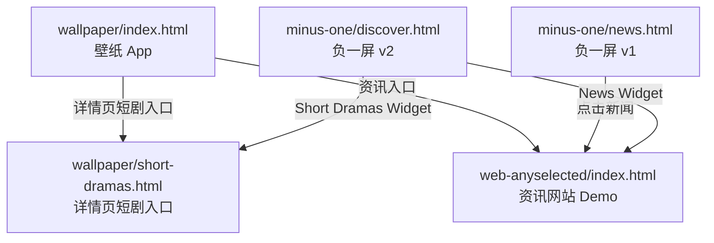

# 页面跳转关系图

## 目录结构

```
pages-mobile/
├── wallpaper/index.html           壁纸 App
├── wallpaper/short-dramas.html    详情页短剧入口
├── minus-one/news.html            负一屏 v1
├── minus-one/discover.html        负一屏 v2
├── minus-one/discover-skeleton.html
└── web-anyselected/index.html     资讯网站 Demo
```

## 关系总览



## 跳转矩阵

| 来源 | 目标 |
|------|------|
| 负一屏 v1 `news.html` | 点击条目 → `web-anyselected/index.html?id=N` |
| 负一屏 v2 `discover.html` | News → web-anyselected；短剧 → `wallpaper/short-dramas.html` |
| 壁纸 App 详情页 | 资讯 → web-anyselected；短剧 → `wallpaper/short-dramas.html` |
| web-anyselected | 列表 / 详情 / 说明页 / 多语言（URL 参数） |

---

*本地预览：直接打开 `pages-mobile/` 下对应 HTML。可选 `bash scripts/deploy.sh` 复制到 `dist/` 打包分享。*
